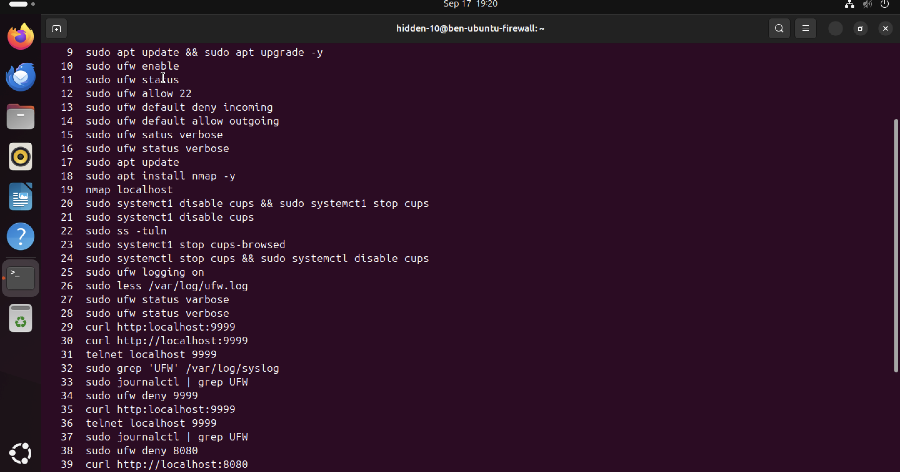
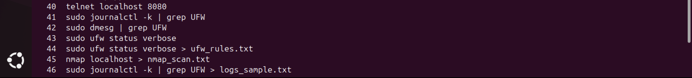

# firewall-security-project
This is my hands-on project demonstrating Linux firewall configuration, port scanning, and system hardening.
# Ubuntu Firewall Security Lab 🔒

## Overview
This project demonstrates configuring and testing a firewall on Ubuntu Server using **UFW (Uncomplicated Firewall)** and validating the setup with **Nmap**.  
The goal was to harden a virtualized Linux environment by blocking unauthorized access, only allowing necessary services, and disabling unused system processes.  

---

## Tools Used
- Ubuntu Server (virtualized in UTM/VirtualBox)
- UFW (Uncomplicated Firewall)
- Nmap (port scanning & validation)
- Linux Command Line

---

## Steps Performed
1. Installed Ubuntu Server ina virtual machine.  
2. Configured UFW firewall rules:  
   - Default **deny incoming** connections.  
   - Default **allow outgoing** connections.  
   - Allowed only SSH (port 22) and other required services.  
3. Ran **Nmap scans** from an external host to confirm blocked/allowed ports.  
4. Identified and disabled unnecessary services (CUPS on port 631).  
5. Documented results with screenshots and command logs.  

---

## Results
- Unauthorized ports were successfully blocked.  
- Nmap confirmed only explicitly allowed services were open.  
- Unnecessary services were disabled, reducing the attack surface.

 ### Visual Proof

---

## Skills Learned
- Linux system administration  
- Firewall configuration and management  
- Port scanning and vulnerability validation  
- System hardening best practices  
- Understanding Technical documentation   

---
